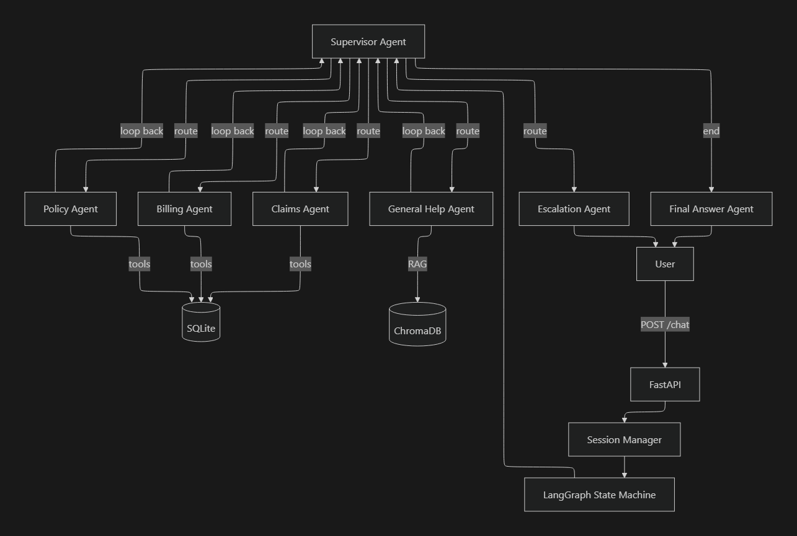

# Multi-Agent Insurance Support API

**TL;DR** I built a 6-agent insurance support system that routes, reasons, calls tools, and retrieves FAQs. It runs on a model smaller than most VS Code extensions, with a context window that can barely fit this paragraph. It works. Almost alarmingly well.

> **What if you could build a production-grade multi-agent system with supervisor routing, ReAct tool calling, RAG, real-time streaming, all this without a single cloud API call, running entirely on a 3.8B parameter model with only 4k tokens of context?**

**But Why? you may ask.**
>Because my laptop has 8GB RAM and strong opinions about what should or should not run on it. 

Most multi-agent examples assume GPT-4 with 128k context and native function calling. **This project throws away those luxuries**. It runs **phi-3-mini** (Q3_K_M quantized, ~2 GB) via **llama.cpp** on local hardware and solves every problem that creates: no function-call API, a tiny context window, and unpredictable output formatting from aggressive quantization.

The result is an insurance customer support system where a supervisor agent routes queries to domain specialists (policy, billing, claims, general help) that use ReAct-style reasoning to query a SQLite database, retrieve FAQs from a ChromaDB vector store, or escalate to a human — all observable in real-time through a built-in debug dashboard(Simple HTML/CSS, I don't do that frontend witchcraft).


---

## What makes this interesting

This isn't a wrapper around an API. The core engineering challenges come from the constraints of running a small local model(especially with a fan that spins like a jet engine whenever llama.cpp loads):

### **The model can't call functions.**
 phi-3-mini has no tool-use API. So the system describes tools in plain-text prompts, lets the model write free-text responses, and parses them through a **4-layer fallback parser** — JSON extraction, regex patterns, keyword matching, then treating the whole response as a final answer. Each layer catches what the previous one missed.

### **The context window is 4,096 tokens.**
 That's prompt + conversation history + tool results + response, combined. A single insurance query can eat half the window.

 The **context manager** uses a sliding window (newest messages first), extracts entity IDs (policy/customer/claim numbers) via regex so they survive compression, and LLM-summarizes older messages — all within a reserved budget of ~3,200 tokens.

### **Quantization breaks formatting.**
 Q3_K_M quantization (needed to fit in ~2 GB RAM) causes the model to occasionally produce garbled JSON, missing delimiters, or hallucinated tool names.

_Sometimes it writes {action": "get_policy and confidently calls it a day. The parser disagrees._

Instead of crashing, the system retries with explicit format reminders and degrades through the parser layers. The debug dashboard shows exactly which parser layer handled each step.

---

## How this compares

| | This project | Typical multi-agent tutorial |
|---|---|---|
| **LLM** | phi-3-mini 3.8B, quantized, local | GPT-4 / Claude, cloud API |
| **Context window** | 4,096 tokens (managed) | 128k+ tokens (unlimited in practice) |
| **Function calling** | Custom 4-layer parser on free text | Native tool_use / function_call API |
| **Cost** | $0 (runs on your hardware) | $0.01–0.06 per request |
| **Observability** | Built-in SSE streaming + debug dashboard | External tools (LangSmith, Phoenix) |
| **RAG** | ChromaDB with sentence-transformers | Same (this part is standard) |
| **Error handling** | Defensive — retries, fallbacks, graceful degradation | Mostly unnecessary (GPT-4 rarely malforms) |
| **Emotional stability** | Occasionally dramatic | Very stable |
| **Formatting reliability** | Depends on moon phase | Very reliable |
---

## Architecture




### Request lifecycle

1. **Supervisor** reads the user message, picks the best specialist, and writes a task description
2. **Specialist agent** runs a ReAct loop (Think → Act → Observe, up to 3 tool steps)
3. Free-text output hits the **4-layer parser** — extracts a tool call or detects a final answer
4. Tools query **SQLite** (8 tables: customers, policies, billing, claims, etc.) or **ChromaDB** (FAQ retrieval)
5. Supervisor can loop back for follow-ups or route to a different specialist (up to 6 total iterations)
6. **Final Answer agent** rewrites the raw specialist output into a polished customer-facing response
7. All events stream to the client via **SSE** in real-time

### The ReAct parser in detail

```
LLM raw output
     │
     ▼
┌─────────────────┐    found action JSON?
│  Layer 1: JSON  │──── yes ──► execute tool
│  extraction     │
└────────┬────────┘
         │ no
         ▼
┌─────────────────┐    found Action:/Action Input: lines?
│  Layer 2: Regex │──── yes ──► execute tool
│  patterns       │
└────────┬────────┘
         │ no
         ▼
┌─────────────────┐    known tool name in text?
│  Layer 3:       │──── yes ──► execute tool (best-effort args)
│  Keyword match  │
└────────┬────────┘
         │ no
         ▼
┌─────────────────┐
│  Layer 4:       │──► treat entire response as Final Answer
│  Fallback       │
└─────────────────┘
```

Each layer is a safety net for the one above. In production with Q3_K_M quantization, roughly 60% of tool calls parse at Layer 1, 25% at Layer 2, and 15% need Layer 3 or 4.

---

## Quick start

### Prerequisites

- Python 3.10+
- [uv](https://docs.astral.sh/uv/) package manager
- [llama.cpp](https://github.com/ggerganov/llama.cpp) with `phi-3-mini-4k-instruct` GGUF model (Q3_K_M recommended)

### Setup

```bash
# Install dependencies
uv sync --extra dev

# Copy and configure environment
cp .env.example .env
# Edit .env if your llama.cpp server runs on a different port

# Seed the SQLite database (1000 customers, 1500 policies, etc.)
uv run python -m scripts.seed_db

# Seed ChromaDB with FAQ embeddings
uv run python -m scripts.seed_chroma

# Run tests (no LLM needed — uses mocked client)
uv run pytest tests/ -v

# Start llama.cpp server (in a separate terminal)
llama-server -m phi-3-mini-4k-instruct.Q3_K_M.gguf -c 4096 --port 8080

# Start the API
uv run uvicorn app.main:app --reload
```

Open **http://localhost:8000** to access the debug dashboard.

### Configuration

```env
LLM_BASE_URL=http://localhost:8080/v1
LLM_MODEL=phi-3-mini-4k-instruct
LLM_API_KEY=not-needed
DATABASE_URL=sqlite+aiosqlite:///./insurance_support.db
CHROMA_PERSIST_DIR=./chroma_db
CHROMA_COLLECTION=insurance_FAQ_collection
LOG_LEVEL=INFO
LOG_FORMAT=json
```

---

## API

### `GET /health`
```bash
curl http://localhost:8000/health
# {"status": "ok", "version": "0.1.0"}
```

### `POST /chat`
```bash
# First message
curl -X POST http://localhost:8000/chat \
  -H "Content-Type: application/json" \
  -d '{"message": "What is the premium for policy POL000004?"}'

# Continue the conversation
curl -X POST http://localhost:8000/chat \
  -H "Content-Type: application/json" \
  -d '{"message": "What about the billing?", "conversation_id": "<id-from-above>"}'
```

| Field | Type | Required | Description |
|---|---|---|---|
| `message` | string | yes | User message |
| `conversation_id` | string | no | Resume existing conversation |
| `customer_id` | string | no | Pre-fill customer context |
| `policy_number` | string | no | Pre-fill policy context |
| `claim_id` | string | no | Pre-fill claim context |

**Response:**
```json
{
  "conversation_id": "uuid",
  "message": "Your premium is $197.88.",
  "agent_trace": [
    {"agent": "supervisor", "action": "route", "detail": "-> billing_agent: ...", "timestamp": "..."},
    {"agent": "billing_agent", "action": "respond", "detail": "...", "timestamp": "..."}
  ],
  "requires_human": false
}
```

### `GET /chat/{conversation_id}/events`
SSE stream of real-time agent events (routing, tool calls, ReAct steps, errors).
```bash
curl -N http://localhost:8000/chat/<conversation_id>/events
```

### `GET /`
Redirects to the built-in debug dashboard.

---

## Engineering lessons

Things I learned building this that wouldn't show up in a tutorial:

**Small models need structured prompts, not clever prompts.** With GPT-4 you can write natural-language instructions and it figures out the format. phi-3-mini needs exact templates: "You MUST respond with this JSON structure." Even then, it drifts — which is why the parser has 4 layers instead of 1.

**Context management is an engineering problem, not a model problem.** When you only have 4k tokens, you can't just dump the conversation history. You need a budget: how many tokens for the system prompt, how many for history, how many reserved for the response. The sliding window + compression approach emerged from trial and error — pure truncation loses critical entity IDs, pure summarization is too slow.

**Quantization errors aren't bugs, they're a feature of the system.** Q3_K_M gives you a model that fits in 2 GB but occasionally outputs `{action": "get_policy` (missing opening brace) or `Action: get_billing_info\nAction Input: policy_number = POL000004` (wrong format). The system needs to handle these as expected behavior, not edge cases.

**Observability isn't optional with unpredictable models.** When a tool call fails, you need to know: did the model hallucinate a tool name? Did the parser extract wrong arguments? Did the tool itself error? The SSE event stream and debug dashboard exist because `print(response)` wasn't enough to debug multi-agent routing with a model that formats differently every time.

**Graceful degradation compounds.** RAG can fail (ChromaDB not initialized), tool calls can fail (wrong args), the parser can fail (unrecognizable output). Each has a fallback: empty FAQ results, error message fed back to the model, treat-as-final-answer. Stacking these means the system almost never returns a 500 — it just gives a less-informed response.

---

## Debugging tips

**llama.cpp not responding:**
Make sure the server is running on the port specified in `LLM_BASE_URL`. Test with:
```bash
curl http://localhost:8080/v1/models
```

**Garbled or malformed tool calls:**
This is normal with Q3_K_M quantization. The 4-layer parser handles most cases. If the model consistently fails on a query, check the trace panel in the debug dashboard — the `parse_method` field shows which parser layer succeeded. Keyword fallback (layer 3) means the model's formatting was poor but recoverable.

**Context window overflow in long conversations:**
The context manager compresses older messages automatically. If you see truncated responses, the conversation may be hitting the ~3200 token budget. Start a new conversation or provide entity IDs (customer_id, policy_number) directly to reduce lookup steps.

**ChromaDB errors on Windows:**
The `onnxruntime` dependency can have compatibility issues on Windows. FAQ retrieval is non-critical — the system works without it. RAG tests are marked `xfail` for this reason.

**Tests failing after schema changes:**
Tests use an in-memory SQLite database seeded by fixtures, not the on-disk database. Run `uv run python -m scripts.seed_db` to re-seed the development database separately.

---

## Testing

```bash
uv run pytest tests/ -v                        # All 77 tests
uv run pytest tests/test_react_parser.py -v     # ReAct parser — 14 tests
uv run pytest tests/test_tools.py -v            # Tool functions — 7 tests
uv run pytest tests/test_integration.py -v      # Integration scenarios — 11 tests
```

All tests run against a `MockLLMClient` with deterministic responses — no LLM server needed.

---

## Project structure

```
├── app/
│   ├── agents/           # Supervisor, specialists, ReAct base class, LangGraph wiring
│   │   ├── base.py       # BaseAgent — ReAct loop with tool execution (max 3 steps)
│   │   ├── graph.py      # LangGraph state machine (the brain)
│   │   ├── supervisor.py # Routes to specialist agents based on user intent
│   │   └── ...           # policy.py, billing.py, claims.py, escalation.py, etc.
│   ├── models/           # SQLAlchemy ORM (8 tables), Pydantic schemas, LangGraph state
│   ├── prompts/          # Externalized prompt templates per agent
│   ├── routes/           # FastAPI endpoints — /health, /chat, /chat/{id}/events
│   ├── services/         # LLM client, database, RAG, context management, sessions
│   ├── tools/            # Tool functions + registry (Pydantic return types)
│   ├── utils/            # ReAct parser (4-layer), token counter
│   ├── static/           # Debug dashboard (single HTML file)
│   ├── config.py         # Pydantic Settings (loads .env)
│   ├── exceptions.py     # Exception hierarchy → HTTP status codes
│   ├── logging_config.py # Structured JSON logging with conversation-ID context var
│   └── main.py           # FastAPI app with lifespan hooks + middleware
├── scripts/              # Database and ChromaDB seed scripts
├── tests/                # 77 tests across 12 files
├── pyproject.toml
└── .env.example
```

## Build log

The project was built incrementally, each commit adding a distinct layer:

| # | Commit | What was added |
|---|--------|----------------|
| 1 | `feat: initialize project skeleton` | FastAPI app, Pydantic settings, health endpoint |
| 2 | `feat: add structured JSON logging` | JSON logger with conversation-ID correlation via context vars |
| 3 | `feat: add SQLAlchemy async models` | 8-table ORM, database service, agent_events table, seed script |
| 4 | `feat: add Pydantic schemas` | Request/response models, typed LangGraph state |
| 5 | `feat: add LLM client` | OpenAI-compatible client abstraction with ReAct-style parser |
| 6 | `feat: add tool functions` | Async tools with registry pattern and Pydantic return types |
| 7 | `feat: add prompt templates` | Externalized prompts with ReAct format instructions per agent |
| 8 | `feat: add context manager` | Sliding window, compression, entity extraction for 4k window |
| 9 | `feat: add ChromaDB RAG` | FAQ retrieval via vector search, seeding script |
| 10 | `feat: implement agents` | All agent classes with ReAct loop and structured event logging |
| 11 | `feat: wire LangGraph` | State machine with conditional routing and clarification handling |
| 12 | `feat: add /chat endpoint` | POST /chat with session management and dependency injection |
| 13 | `feat: add exception hierarchy` | Custom exceptions → HTTP status codes, graceful degradation |
| 14 | `feat: add SSE streaming` | Real-time agent event streaming via Server-Sent Events |
| 15 | `test: add integration tests` | Multi-turn, FAQ, escalation, parser fallback scenarios |
| 16 | `docs: add README` | Setup instructions, API reference, architecture docs |
| 17 | `refactor: migrate to llama.cpp` | Replaced LM Studio with llama-server for lighter deployment |
| 18 | `fix: add defensive guardrails` | Handle Q3_K_M quantization artifacts in ReAct parsing |
| 19 | `feat: add debug dashboard` | Built-in browser UI with live agent trace visualization |
